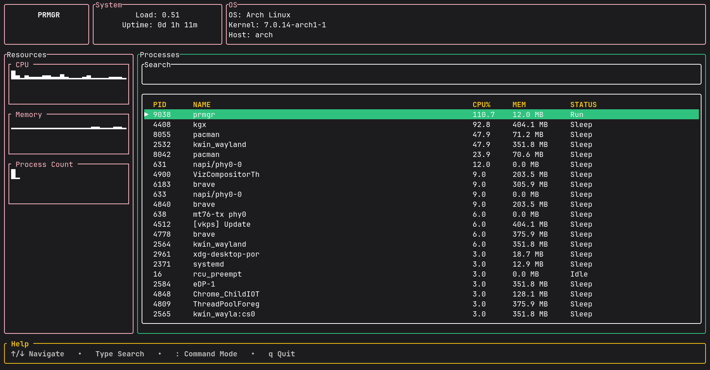

# prmgr

A fast, lightweight terminal-based process manager written in Rust using Ratatui.

`prmgr` provides a modern TUI for monitoring system processes, viewing resource usage, and interacting with running processes directly from your terminal.

## Features

* 📊 Live CPU usage graph
* 💾 Live memory usage graph
* 📋 Interactive process table
* 🔍 Process search
* ⌨️ Keyboard-driven interface
* ⚡ Fast and lightweight
* 🦀 Written entirely in Rust

## Installation

### Linux

Install the latest release with:

```bash
curl -fsSL https://raw.githubusercontent.com/Shu045/prmgr/main/install.sh | bash
```

After installation, simply run:

```bash
prmgr
```

## Building from Source

### Prerequisites

* Rust (latest stable)
* Cargo

Clone the repository:

```bash
git clone git@github.com:Shu045/prmgr.git
cd prmgr
```

Build a release binary:

```bash
cargo build --release
```

Run directly:

```bash
./target/release/prmgr
```

Or run in development mode:

```bash
cargo run
```

## Controls

| Key   | Action             |
| ----- | ------------------ |
| ↑ / ↓ | Navigate processes |
| `/`   | Search processes   |
| `Esc` | Exit search mode   |
| `q`   | Quit               |

> The key bindings may evolve as new features are added.

## Screenshots



## Roadmap

* [ ] Kill selected process
* [ ] Sort by CPU usage
* [ ] Sort by memory usage
* [ ] Process filtering
* [ ] Network usage graph
* [ ] Disk I/O statistics
* [ ] Multi-platform releases
* [ ] Automatic update checker

## Contributing

Contributions, issues, and feature requests are welcome.

If you have an idea or find a bug, feel free to open an issue or submit a pull request.

## License

This project is licensed under the MIT License.
